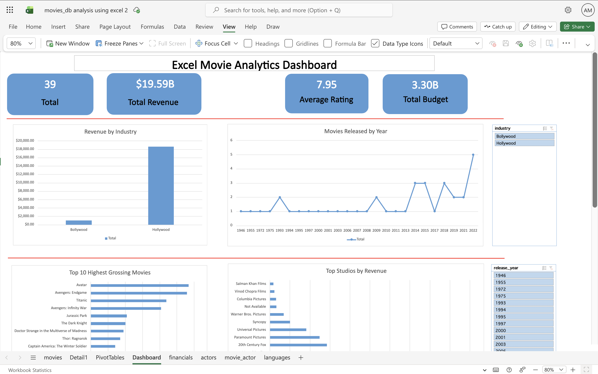
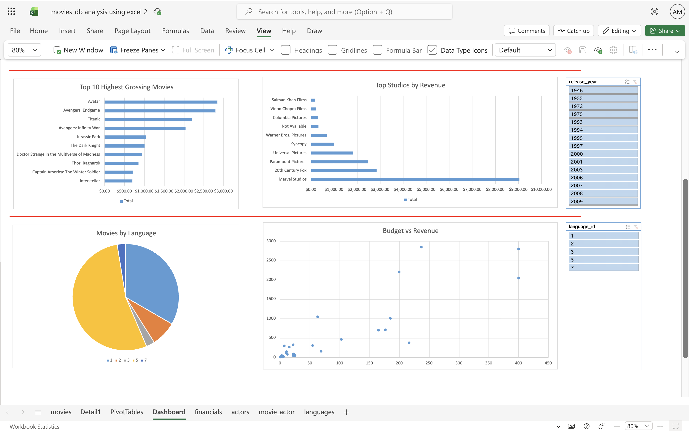

# Excel Movie Analytics Dashboard

An interactive **Microsoft Excel dashboard** built using Pivot Tables, Pivot Charts, Slicers, and Excel data analysis features to explore movie industry data. This project demonstrates Excel's Business Intelligence capabilities by transforming raw movie datasets into meaningful visual insights.

---

## Project Overview

This project analyzes a movie dataset containing information about:

- Movies
- Studios
- Industry
- Revenue
- Budget
- IMDb Rating
- Languages
- Release Year

The dashboard provides an interactive way to explore movie performance using Excel's built-in analytics tools.

---

## Dashboard Preview

### Dashboard Overview



---

## Dashboard Features

### KPI Cards

-  Total Movies
-  Total Revenue
-  Average IMDb Rating
-  Total Budget

---

### Interactive Visualizations

- Revenue by Industry
- Movies Released by Year
- Top 10 Highest Grossing Movies
- Top Studios by Revenue
- Movies by Language
- Budget vs Revenue Scatter Plot

---

### Interactive Filters (Slicers)

Users can dynamically filter the dashboard by:

- Industry
- Release Year
- Language

All charts update automatically based on the selected filters.

---

## Dataset Structure

The workbook contains multiple related datasets including:

- Movies
- Financial Information
- Actors
- Movie–Actor Relationship
- Languages

These tables were combined and analyzed using Excel features to create Pivot Tables and interactive dashboards.

---

## Excel Features Used

- Pivot Tables
- Pivot Charts
- Slicers
- Excel Tables
- Custom KPI Cards
- Scatter Plot
- Bar Charts
- Pie Chart
- Line Chart
- Dashboard Design & Formatting

---

## 📁 Repository Structure

```
Excel Movie Analytics Dashboard/
│
└── screenshots/
    ├── dashboard-overview.png
    └── dashboard-overview-2.png
├── README.md
├── movies_db analysis using excel.xlsx
```

---

## Key Insights

- Hollywood generated significantly higher revenue than Bollywood in the dataset.
- Marvel Studios emerged as the highest revenue-generating studio.
- Avatar is the highest-grossing movie.
- Movie releases increased noticeably after 2014.
- English-language movies dominate the dataset.
- Higher-budget movies generally tend to generate higher revenues.

---

## Skills Demonstrated

- Microsoft Excel
- Business Intelligence
- Dashboard Design
- Data Visualization
- Pivot Tables
- Pivot Charts
- Interactive Reporting
- Data Analysis

---

## Dashboard Screenshots

### Upper Dashboard


### Lower Dashboard



---

## Future Improvements

- Add dynamic KPI cards linked directly to Pivot Tables
- Add Timeline filter for Release Year
- Add conditional formatting for KPIs
- Create additional drill-down reports
- Automate dashboard refresh using Power Query
