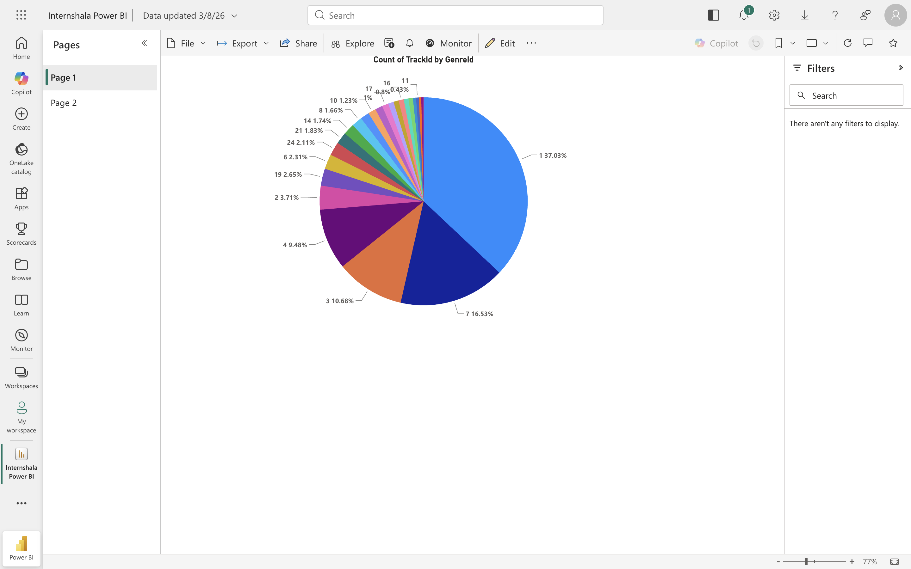
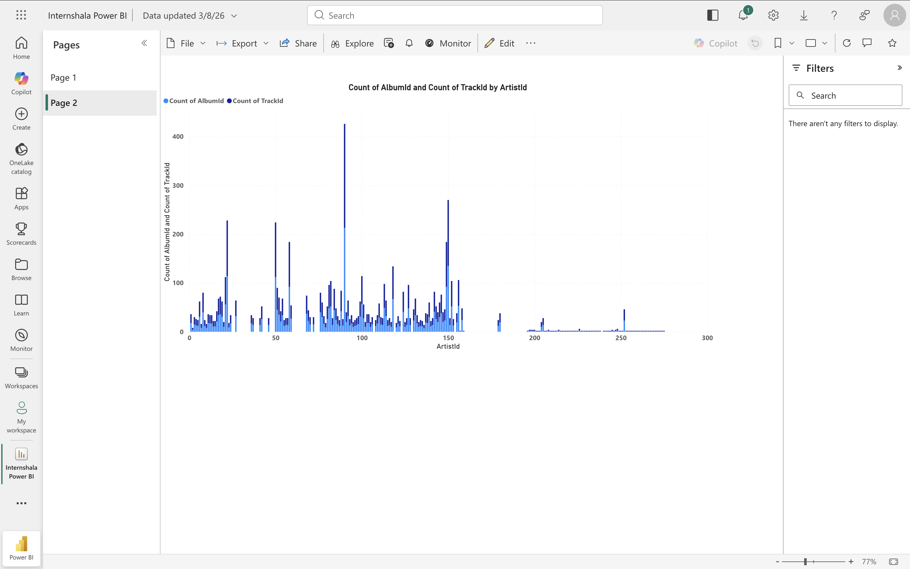
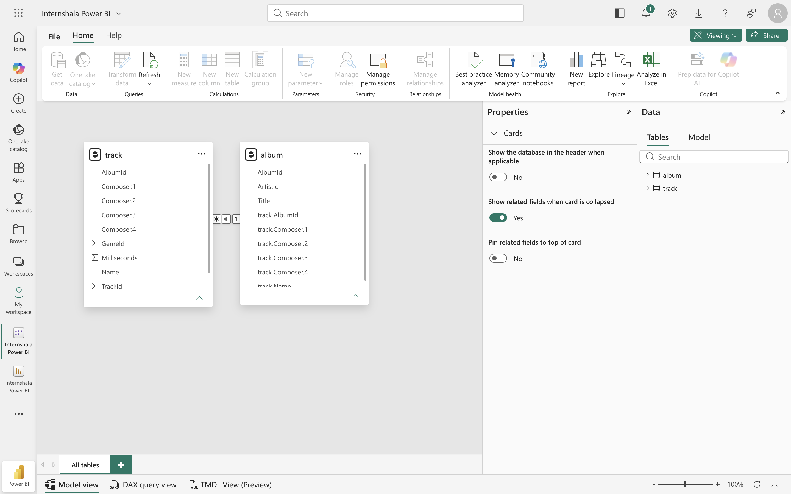

# Power BI Fundamentals – Music Dataset Analysis

## Project Overview

This project demonstrates the core concepts of Microsoft Power BI using a music dataset containing albums and tracks.

The objective was to transform raw data into meaningful visualizations by performing data cleaning, data modeling, and dashboard creation. The project focuses on building a strong foundation in Power BI for data analysis and business reporting.

---

# Business Problem

A music company stores album and track information across multiple datasets. Without a structured reporting system, it becomes difficult to:

- Understand the distribution of music tracks
- Explore relationships between albums and artists
- Analyze data efficiently for reporting
- Maintain clean and consistent datasets for visualization

The goal was to prepare the raw data and build an interactive dashboard that makes the information easier to understand.

---

# Solution

The solution was developed using Microsoft Power BI.

The workflow included:

- Importing multiple datasets
- Cleaning and transforming data using Power Query
- Replacing missing values
- Removing duplicate records
- Removing unnecessary columns
- Building relationships between Album and Track tables
- Creating interactive visualizations
- Formatting reports for better readability

---

# Dashboard Preview

## Dashboard - Page 1



---

## Dashboard - Page 2



---

## Data Model



---

# Key Insights

The dashboard helps users quickly understand:

- Distribution of tracks across different genres
- Number of tracks associated with different artists
- Relationship between albums and tracks
- Dataset structure through a relational data model

This project focuses on demonstrating Power BI fundamentals rather than generating advanced business insights.

---

# Data Preparation

The following transformations were performed using Power Query:

- Extracted required values
- Split columns
- Replaced missing Composer values with **"Unknown"**
- Removed duplicate Track IDs
- Removed blank records
- Removed unnecessary columns
- Created relationships between Album and Track tables

---

# Tools & Technologies

- Microsoft Power BI
- Power Query
- Data Modeling
- Data Cleaning
- Data Visualization

---

# Repository Structure

```
Power BI Fundamentals - Music Dataset
│
├── Internshala Power BI.pbix
├── PowerBI Project Case Study.pdf
├── album.csv
├── track.csv
├── README.md
└── Screenshots
    ├── dashboard-page1.png
    ├── dashboard-page2.png
    └── model-view.png
```

---

# Skills Demonstrated

- Power BI Dashboard Development
- Power Query
- Data Cleaning
- Data Transformation
- Data Modeling
- Relationship Building
- Interactive Visualizations
- Report Formatting

---

# Learning Outcome

This project strengthened my understanding of:

- Data preparation in Power BI
- Building relationships between multiple tables
- Creating interactive dashboards
- Converting raw datasets into meaningful visual reports
- Presenting data in a structured and user-friendly manner

---

## Future Improvements

- Add KPI cards
- Introduce slicers and drill-through functionality
- Create additional business-focused dashboards
- Build DAX measures for advanced analytics
