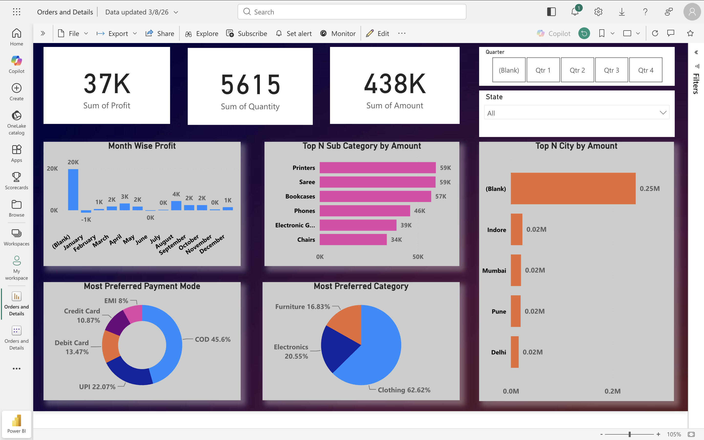
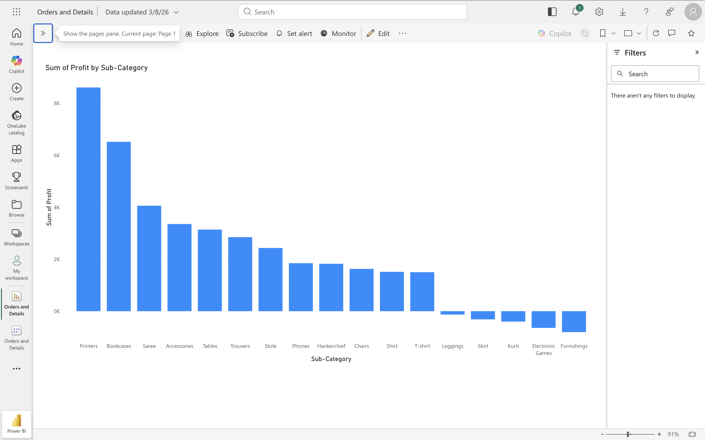
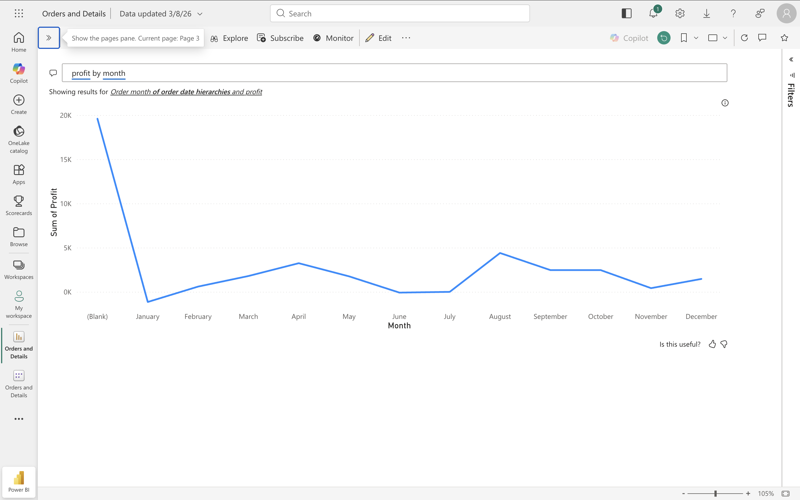
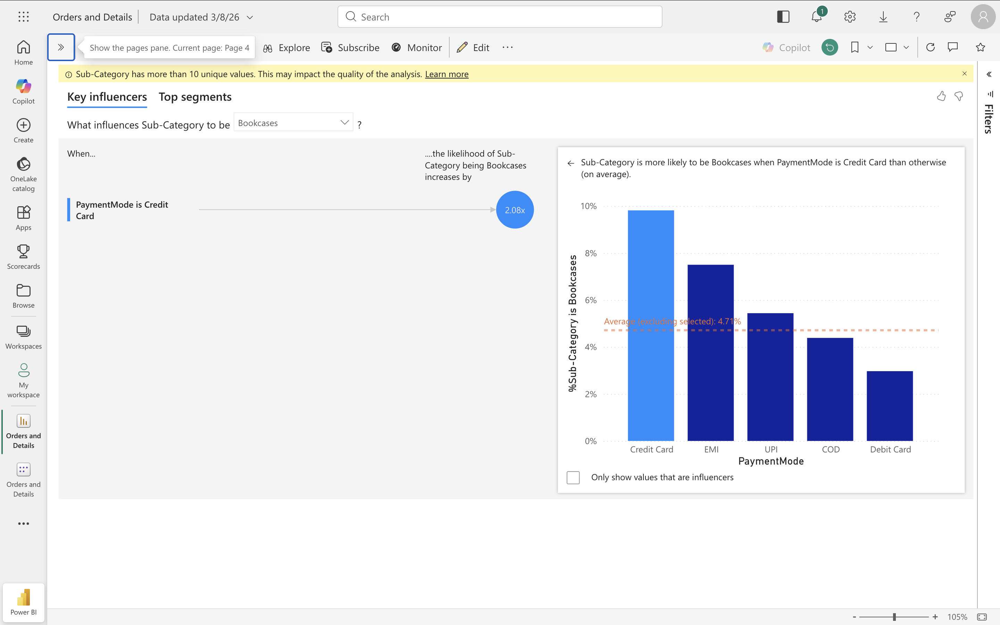
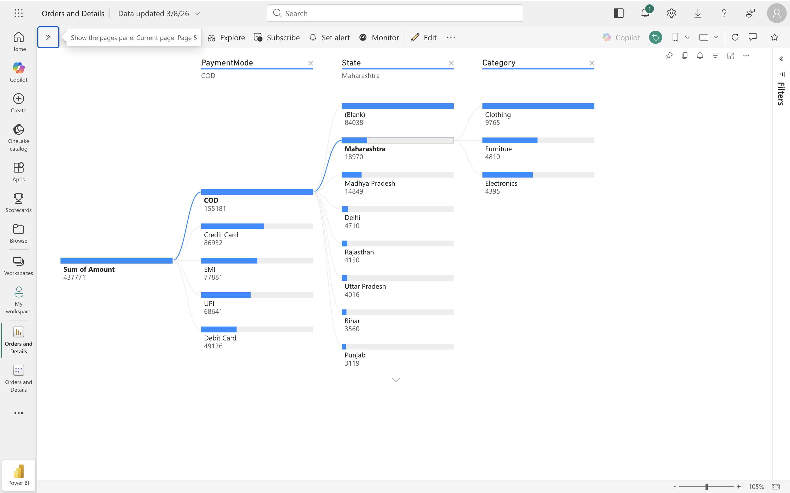
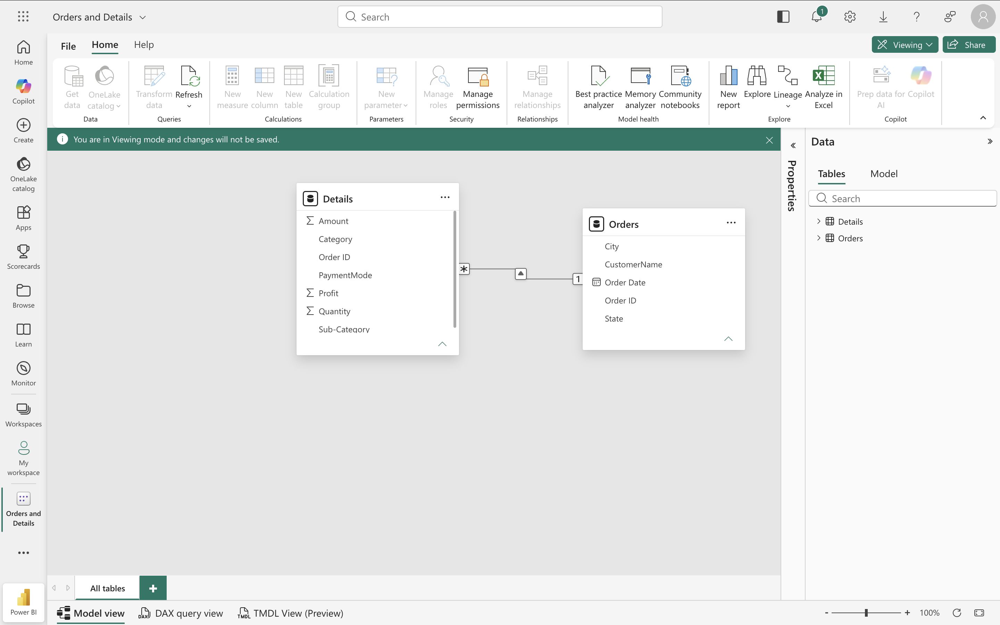

# Power BI Sales Dashboard – Orders & Details Analysis

## Business Problem

Business managers often struggle to identify sales performance trends, profitable product categories, preferred payment methods, and regional sales performance from raw Excel data.

This project transforms transactional sales data into an interactive Power BI dashboard, enabling decision-makers to monitor KPIs, analyze profitability, and explore sales performance through multiple visualizations.

---

# Dashboard Preview

## Executive Dashboard



---

## Profit by Product Sub-Category



---

## Profit Trend by Month



---

## Key Influencers Analysis



---

## Decomposition Tree Analysis



---

## Data Model



---

# Project Objectives

- Build an interactive Power BI sales dashboard
- Analyze sales amount, profit and quantity
- Identify high-performing product categories
- Compare payment methods
- Analyze customer purchasing trends
- Explore regional sales performance
- Demonstrate advanced Power BI visualizations

---

# Dataset

The project uses two Excel datasets:

- Orders.xlsx
- Details.xlsx

The datasets are connected through a common Order ID relationship.

---

# Business Questions Answered

- Which product sub-categories generate the highest profit?
- Which months generate the highest profit?
- Which payment method is preferred by customers?
- Which product category contributes the most sales?
- Which cities generate the highest revenue?
- Which factors influence product purchases?
- How does profit change throughout the year?

---

# Key Insights

### Sales Performance

- Total Sales Amount reached approximately **438K**
- Total Profit was approximately **37K**
- More than **5,600 units** were sold

### Product Analysis

- Printers generated the highest profit.
- Bookcases and Sarees were also among the best-performing sub-categories.
- Electronic Games and Furnishings produced negative profit.

### Customer Behaviour

- Cash on Delivery (COD) was the most preferred payment method.
- Clothing represented the largest product category.

### Regional Analysis

- Maharashtra contributed the highest sales amount.
- Indore, Mumbai, Pune and Delhi were among the leading cities.

### Trend Analysis

- Profit fluctuated throughout the year with stronger performance during selected months.

### AI Insights

Power BI AI visuals were used to identify:

- Key influencers affecting product purchases
- Decomposition of sales by Payment Mode, State and Category

---

# Data Model

The dashboard follows a relational model connecting:

Orders

↓

Order ID

↓

Details

This enables efficient filtering and interactive reporting across all visuals.

---

# Tools & Technologies

- Microsoft Power BI
- Microsoft Excel
- Power Query
- Data Modeling
- DAX
- Interactive Visualizations

---

# Skills Demonstrated

- Data Cleaning
- Data Modeling
- KPI Design
- Dashboard Development
- Business Intelligence
- Data Visualization
- Interactive Reporting
- AI Visuals
- Decomposition Tree
- Key Influencers
- Relationship Modeling

---

# Repository Structure

```
Power BI Sales Dashboard – Orders & Details Analysis

├── Orders.xlsx
├── Details.xlsx
├── Orders and Details.pbix
├── README.md
└── screenshots
    ├── data-model.png
    ├── decomposition-tree.png
    ├── executive-dashboard.png
    ├── key-influencers.png
    ├── monthly-profit-trend.png
    └── profit-analysis.png
```

---

# Learning Outcome

Through this project I gained practical experience in:

- Building business dashboards
- Creating KPI reports
- Data modelling in Power BI
- Designing interactive reports
- Business performance analysis
- AI-powered analytics using Power BI
