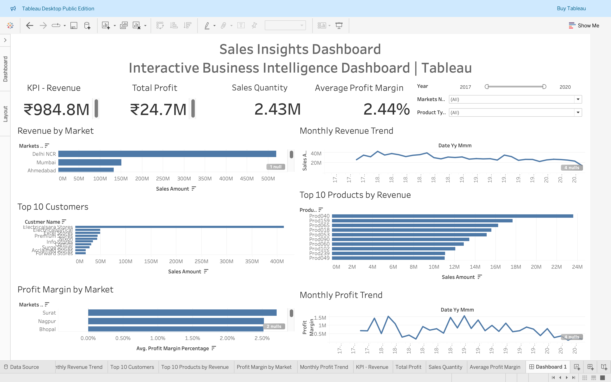
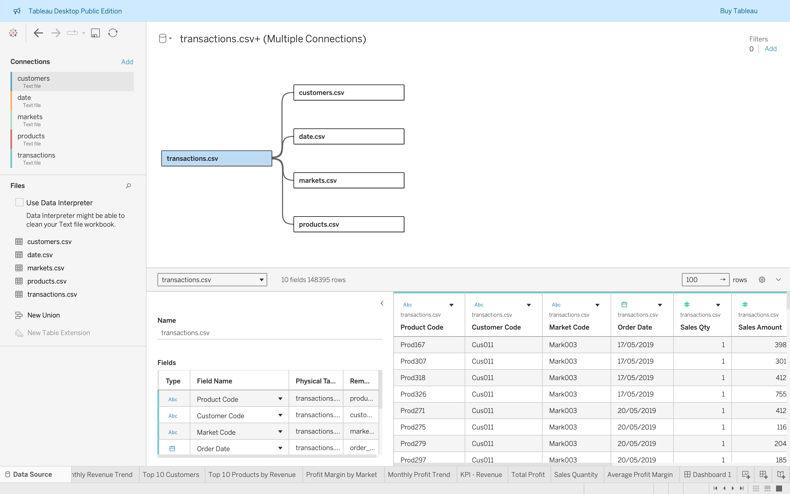

# Tableau Sales Insights Dashboard

An interactive Business Intelligence dashboard built using **Tableau** to analyze sales performance across markets, customers, products, and time. This project transforms raw sales data into actionable business insights through interactive visualizations and KPIs.

---

# Business Problem

Business stakeholders needed a centralized dashboard to monitor sales performance and answer questions such as:

- Which markets generate the highest revenue?
- How are monthly revenue and profit changing over time?
- Who are the top customers?
- Which products generate the most revenue?
- Which markets have the highest profit margins?

Instead of manually analyzing multiple tables, an interactive dashboard was created to provide real-time business insights.

---

# Solution

The project was built using Tableau by following a complete Business Intelligence workflow:

- Imported and connected multiple CSV datasets exported from a MySQL database
- Established relationships between Customers, Products, Markets, Transactions, and Date tables
- Built calculated KPIs for:
  - Total Revenue
  - Total Profit
  - Sales Quantity
  - Average Profit Margin
- Designed interactive charts for:
  - Revenue by Market
  - Monthly Revenue Trend
  - Top 10 Customers
  - Top 10 Products by Revenue
  - Profit Margin by Market
  - Monthly Profit Trend
- Added interactive filters for:
  - Year
  - Market
  - Product Type

The final dashboard enables users to explore sales performance from different business perspectives.

---

# Key Business Insights

- Delhi NCR contributes the highest overall revenue.
- Revenue fluctuates over time with noticeable peaks and declines across months.
- A small number of customers generate a significant share of total revenue.
- A few products consistently outperform others in sales.
- Profit margins vary across markets, highlighting opportunities for optimization.
- Interactive filters allow business users to analyze specific years, markets, and product categories.

---

# Dashboard Preview

## Sales Insights Dashboard



---

## Data Model

The dashboard is built using multiple related datasets exported from MySQL.



---

# Project Structure

```text
Tableau Sales Insights Dashboard/
│
└── Screenshots/
    ├── dashboard-overview.png
    └── data-model.png
├── csv_data/
│   ├── customers.csv
│   ├── products.csv
│   ├── markets.csv
│   ├── transactions.csv
│   └── date.csv
├── Sales Insights Dashboard.twb
├── db_dump.sql
├── db_dump_version_2.sql
├── export_sales_data.ipynb

```

---

# Tools & Technologies

- Tableau Desktop Public
- MySQL
- Python
- Pandas
- Jupyter Notebook
- CSV

---

# Dashboard Features

- Executive KPI Cards
- Interactive Filters
- Revenue Analysis
- Profit Analysis
- Customer Analysis
- Product Analysis
- Market Performance Analysis
- Monthly Trend Analysis

---

# Skills Demonstrated

- Business Intelligence
- Data Visualization
- Dashboard Design
- Data Modeling
- Data Preparation
- Data Analysis
- KPI Development
- Relational Data Modeling
- SQL Database Integration
- Interactive Reporting

---

# How to Run

1. Import the SQL database using:

```sql
db_dump_version_2.sql
```

2. Export database tables as CSV files using:

```
export_sales_data.ipynb
```

3. Open:

```
Sales Insights Dashboard.twb
```

4. If prompted, reconnect the workbook to the `csv_data` folder.

---

# Project Highlights

- Built an interactive executive sales dashboard in Tableau.
- Connected five related datasets using relational data modeling.
- Created business KPIs for revenue, profit, sales quantity, and profit margin.
- Developed interactive dashboards with dynamic filters.
- Enabled data-driven decision-making through clear visual analytics.
